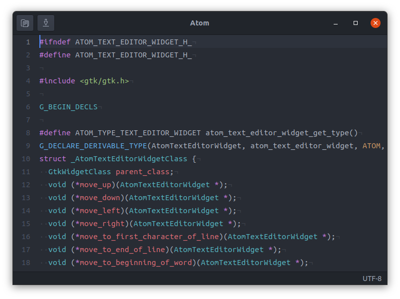

# atom-gtk



## Instructions

```sh
# install the dependencies (e.g. Debian/Ubuntu)
sudo apt install build-essential meson valac sassc libgtk-3-dev libpcre2-dev
# clone the repository
git clone --recursive https://github.com/eyelash/atom-gtk.git
cd atom-gtk
# build and install the application
meson setup build
meson install -C build
# launch the application
atom-gtk
```

## Roadmap

- [x] multiple selections
- [x] select next
- [x] syntax highlighting
- [x] copy/paste
- [x] undo/redo
- [ ] find/replace
- [ ] git gutter
- [ ] fuzzy finder
- [ ] EditorConfig
